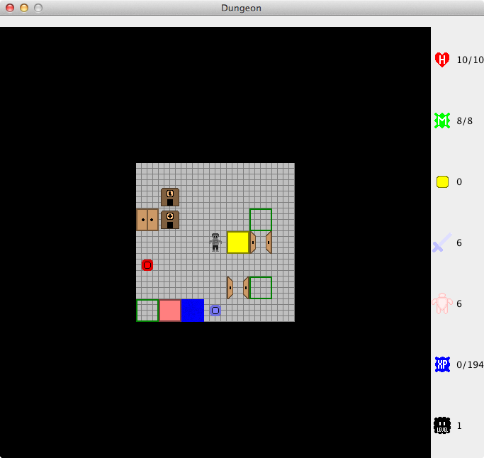
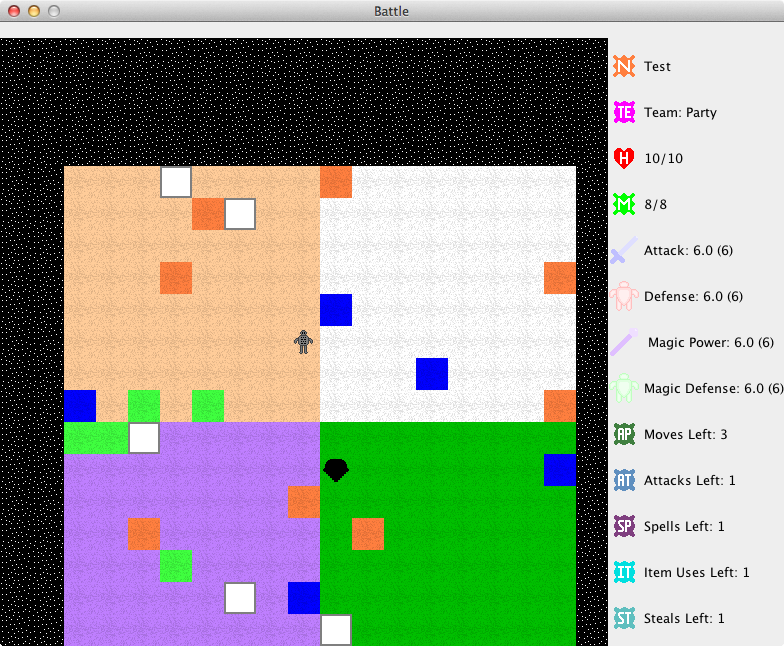

Gemma Manual V2.0.0

Copyright © 2011-2017, Eric Ahnell.

This manual was last updated on August 19, 2017.

Questions / Bug reports / Suggestions

E-mail any questions, bug reports, or suggestions to us at:
support\@puttysoftware.com

ALWAYS include the version of Gemma that you have. A lot of things
change, and without the version number it is pretty tough to verify the
problem. Please try to be as specific as possible. A comment such as,
\"It crashes all the time,\" is too vague, and will not be of any real
value in correcting the problem. Try to describe where you were and what
you were doing, along with your system configuration, and the log file
containing details of the crash, if Gemma crashed. Mac OS X users can
use System Profiler, in the Utilities folder, to generate a system
report of their system configuration.

About This Manual

This manual was created with LibreOffice 5.4. It was exported to HTML
with the built-in Export feature. All the screen shots in this manual
are from the Mac version of the game.

System Requirements

*OS X: *Gemma requires any Intel Mac, running OS X 10.8.0 "Mountain
Lion" or later, 500 MB of free disk space, and Java SE 8.

*Windows: *Gemma requires any Intel or AMD CPU capable of running
Windows XP or later, and 500 MB of free disk space. Java SE 8 or later
is also required -- to get this visit [the Java
website](http://www.oracle.com/technetwork/java/index.html), if you do
not already have it. You only need the JRE, not the JDK.

*Linux: *Gemma requires any Intel or AMD CPU capable of running Linux
2.6 kernel or later, and 500 MB of free disk space. Java SE 8 or later
is also required -- to get this, open up your favorite package manager,
if you do not already have it. You only need the JRE, not the JDK.

Note for All Platforms: The latest available update to Java is strongly
recommended.

The Menus -- An Overview

File

*Open Saved Game...*: Opens an existing Saved Game.

*Close*: Closes the current window.

*Save*: Saves your progress as a Saved Game file.

*Save As*: Saves your progress as a Saved Game file, with a new name.

*Print\...*: Prints the contents of the active window to a printer of
your choosing.

*Preferences*: Allows configuration of various Game Settings. (On Mac OS
X, this command is in the Gemma Menu.)

*Exit* (non-Mac OS X platforms only): Quits the Program. (On Mac OS X,
the Quit Gemma command in the Gemma menu does the same thing.)

Game

*Play*: Allows playing a randomly generated Game, or a game saved
earlier.

*Show Equipment*: Shows all Equipment you are wearing. This command is
only available while playing a Game.

*Show Inventory*: Shows all Items you are carrying. This command is only
available while playing a Game.

*Register Character*: Adds a Character File to the list of registered
files. This command is only available while NOT playing a Game.

*Unregister Character*: Removes a Character File from the list of
registered files. This command is only available while NOT playing a
Game.

*Remove Character*: Removes a Character File from the list of registered
files, then deletes its corresponding disk file. Use with caution, as
this operation is not undoable. This command is only available while NOT
playing a Game.

Edit Note\...: While playing a Game, allows you to leave notes behind
for later.

View Prestige\...: Displays the party leader\'s prestige score, along
with all the components that comprise it. This command is only available
while playing a Game.

View Current Score\...: Displays your overall game score. This is
separate from Prestige, which is specific to each character. This
command is only available while playing a Game.

View Statistics\...: Displays in-depth statistics for any member of your
party. This command is only available while playing a Game.

Battle

*Cast Spell\...*: Brings up the Cast Spell dialog, listing all the
spells you know, and prompts for which one to cast. This command is only
available while in battle.

*Use an Item\...*: Brings up the Use an Item dialog, listing all the
battle-usable items you possess, and prompts for which one to use. This
command is only available while in battle.

*Steal Stuff*: Attempt to steal Gold from a randomly chosen adjacent
enemy. This command is only available while in battle.

*Drain MP*: Attempt to drain MP from a randomly chosen adjacent enemy.
This command is only available while in battle.

*End Turn*: Ends your turn in battle. This command is only available
while in battle.

Help

*Check for Updates\...*: Checks to see if newer versions of the Game are
available. Unlike the startup check, this check is NOT done in the
background.

*About Gemma\....*: Displays the Game's About Box. (On Mac OS X, this
command is in the Gemma Menu.)

*Gemma Help*: Displays a window listing all the Objects and a short
description of what each one does.

*What\'s New in Gemma*: Displays a window listing the game\'s version
history.

Preferences

The Game Preferences are divided into three tabs: *Game*,* Media, *and
*Misc*. *Game* and *Media* are for Game-related and music/sound-related
settings, respectively. The *Misc.* tab has one setting: whether or not
to check for updated versions when the Game is started.

Starting A New Adventure

To start a new adventure, simply choose Play from the Game menu. A
random environment will be generated, after the members of your
adventuring party are chosen; this process is explained below.

How to Assemble Your Party

Upon starting a new adventure, you\'ll be asked to create or pick
characters for your party. The Pick option will only be offered if some
characters already exist. The maximum number of characters that can be
in your party is 1.

Main Screen

This is what Gemma\'s main screen looks like, while adventuring in a
dungeon:

At the top, just below the window border, is the
message area. When there is something to display, it shows up there. On
the right side is the statistics display. The items shown are, from top
to bottom: Health, Magic, Gold, Attack, Defense, Experience, and Monster
Level. In the center is the dungeon itself. You are located in the
center at all times.

Game Controls

To move, use the arrow keys -- Up, Down, Left, and Right. You can also
use the Numeric Keypad (make sure Num Lock is enabled), or the so-called
\"WAXD\" configuration: W moves up, A moves left, D moves right, and X
moves down. Additionally, diagonal movement is supported with WAXD: Q
moves up and left, E moves up and right, Z moves down and left, C moves
down and right. If you wish to move diagonally, the Numeric Keypad or
the WAXD layout are the only ways to do this. Shift+Click an object to
identify it. Its name will be displayed in the Message Area. If, for
some reason, you need to make a \"pass move\" - that is, a do-nothing
move, pressing 5 on the Numeric Keypad or the S key achieves this.

Expanding Dungeon Model

Gemma\'s dungeons dynamically expand as you explore deeper. Each dungeon
starts out with only one area containing monsters at level 1. If you
locate a Stairs Into and step on it for the first time, a new area
containing level 2 monsters will be created, then you will be sent
there. A Stairs Out takes you to an area that is easier in monster
levels -- these never occur on the topmost area (with level 1 monsters).

Dungeon Dangers

In these dungeons, the very ground you walk on may betray you. There are
three kinds of hostile ground: Lava (orange), Water (dark blue), and
Slime (light green). All kinds of hostile ground take health away from
the entire party when stepped on: 5% of your Maximum HP, minimum 1. It
is possible to die from too many steps on hostile ground.

The Race System

The Predefined Races, by Group

*Humanoid Group*: Dwarf, Elf, Gnome, Goblin, Human, Orc, Troll, Vampire

*Robotic Group*: Cyborg, Robot

*Animal Group*: Eagle, Lizard, Penguin, Turtle, Wolf

*Undead Group*: Ghost, Shade

*Organic Group*: Mush, Slime

*Unknown Group*: Demon

How many races are there? (I can\'t count the grouped list.)

Exactly twenty (20) predefined races exist.

How do the races compare against one another?

Good question. For those interested in this sort of thing, there\'s a
table in the Appendix of Tables called Race Stat Growth. That\'s the
place to look.

The Caste System

Gemma has just four castes: Annihilator, Buffer, Curer, and Debuffer.
Your caste determines what spell book you use as well as what weapon set
you use.

The Faith System

How many faiths are there?

There are a total of 9 faiths: None, Heat, Cold, Rock, Gust, Beam, Dead,
Bolt, and Boom.

What has a faith?

Each character in your party has a faith.

NPCs that join you also have a faith.

Even the monsters you fight have faiths.

Many spells and certain items are associated with a faith as well.

What are the effects of having a faith?

Faith affects skill with and defense against faith-aligned attacks and
spells. Those who have the None faith have no skill or defense bonuses
or penalties in any faith.

How do the faiths compare against one another?

Good question. For those interested in this sort of thing, there\'s a
table in the Appendix of Tables called Faith Effectiveness. That\'s the
place to look.

The Personality System

How many personalities are there?

There are a total of 25 personalities. They are listed in the Appendix
of Tables.

What are the effects of having a personality?

Personality affects experience in battle, level up speed, wealth,
carrying capacity, and movement.

How do the personalities compare against one another?

Good question. For those interested in this sort of thing, there\'s a
table in the Appendix of Tables called Personality Data. That\'s the
place to look.

Character Genders

What are the general effects of gender?

Character gender affects the results of equipping and using certain
items. Some items can only be worn by or are only usable by one gender.
Genders primarily exist to give flavor to your characters.

Character Prestige

As your character performs deeds both courageous and cowardly, their
prestige will change. This is a score based on many different factors,
such as the amount of enemies they have killed or how often they are hit
themselves.

Things such as getting killed, missing in battle or failing to resist
spells in battle can all affect your prestige in a negative way.

When you view Prestige Details, Scores in **RED** hurt your prestige,
whereas **BLUE** scores help your prestige.

How prestige points are calculated:

Positive Prestige Points are calculated:

\+ (Damage Given - Damage Taken) / 10 (This could be negative)

\+ Hits Given

\+ Attacks Dodged

\+ 2 x Enemies Killed

Negative Prestige Points are calculated:

\- Hits Taken

\- 2 x Missed Attacks

\- 3 x Number of Spells Cast in Battle

\- 10 x Times You Were Killed In Battle

\- 50 x Times You Ran Away In Battle

Gaining Levels

Defeating monsters in battle is the primary way of earning experience
towards the next level. Any experience earned will be divided as evenly
as possible between the members of your party who are still alive and
conscious and have not fled from battle.

Damage and Death

If you get hit in battle, or step on hostile ground outside of battle,
you suffer damage. If your health is reduced to 0 by this, you die.

Healing During Battle

If you know any healing spells, you may cast them while in battle on
yourself or other party members, to restore lost health. To heal while
outside battle, visit a healing shop.

Note Keeper

Notes may be created/edited while exploring the map by using the Edit
Note\... command in the Game menu. If a note is present on a particular
space of the map, it will be indicated with a little N icon in the
upper-right corner. Your notes are saved along with the rest of the
game\'s state when you save your progress. You can only read notes on
the space your party currently occupies.

Learning Spells

Spells are learned from Spell Shops. Spells may be learned in any order,
if you possess enough Gold to do so.

Spell Damage

The various types of spell damage are inextricably linked to the various
faiths. Each faith-aligned attack deals its own type of damage.

Battle

Battle is fought on a separate and randomly generated map, which is much
smaller than the dungeon map. Battle in Gemma is turn-based, which means
that each creature involved in the battle gets a turn to act, until
everyone has acted. Once that happens, a new round begins, and the cycle
restarts anew. Battle ends once all hostile creatures are defeated, or
your party is defeated.

Battle Special Actions

Pressing and holding the Shift key, then attempting to move when it is
your turn in battle, will cause you to fire an arrow instead of moving.
Arrows never miss, are considerably weaker than melee weapons, and
follow faith rules when determining the damage done. Arrows never
critically hit, and ignore enemy defenses when computing damage.

Battle Map

Above is a screen shot of one possible battle map. As
with the dungeon map, the active character, which may not be you if one
of the monsters is acting, is in the center. The message area at the top
behaves in exactly the same way as the dungeon map version, as does the
statistics display on the right.

Using Weapons to Attack

Moving is accomplished in the same way as on the dungeon map. To attack
something, simply move into it.

Battle Weapon Attack Modifiers

Different things may happen when you attack an enemy in battle with your
weapon.

Critical Hit: Occurs 20% of the time, deals double damage.

Piercing Hit: Occurs 10% of the time, ignores enemy defense when
calculating damage.

It is possible for both events to occur at the same time. Both your
party and the enemies can perform these actions.

Spell Casting Within Battle

To cast a spell, choose Cast Spell\... from the Battle menu. A dialog
will appear, asking for which spell to cast. After one is picked, a
second dialog asks for the power level. After that, a third dialog
prompts for a target to cast the spell at (except self-only spells).
Finally, the spell is cast.

Running Away

To flee from battle, simply attempt to move off the edge of the battle
map. You will be asked to confirm that you wish to embrace cowardice.

Attacking A Friendly Character

If you move into a friendly character, such as a member of your party,
you will be asked to confirm that you wish to attack your friend. If you
elect to attack anyway after this confirmation prompt, the attack will
proceed as usual.

Other Battle Actions

To perform other actions in battle -- casting spells, using items,
stealing Gold, draining the enemy\'s MP, and ending your turn once you
can do no more -- go to the Battle Menu and choose the appropriate
command. Keyboard shortcuts exist for all commands in the Battle Menu.

Items

Items are purchased from shops, and automatically equipped as soon as
the transaction is completed. There are 4 kinds of shops that sell
items: Weapon Shops, Armor Shops, Item Shops (which sell items usable in
battle), and Socks Shops (items that act each time you take a step). Of
the 4 types, only Item Shops sell items that are not equipment.

Enchantments for Equipment

Equipment can be improved in ways other than improving the base material
from which it is made. Socks, however, cannot be enchanted. There are
two kinds of enchantment available:

**Blessing: **Getting this on your equipment increases its
effectiveness. Blessed items will have a +X suffix attached to them,
where X is the number of times it has been blessed. Blessings increase
the power of the item they are applied to. Blessings increase in cost as
more are applied, and cannot be applied more than 9 times to a single
item. Blessings are referred to as \"Bonus\" in the various equipment
formulas.

Blessings are sold at Enhancement Shops, which can be easily
distinguished from other shops by the large E on their doors.

**Faith Power: **Getting this on your equipment increases its
effectiveness also. Faith Powered items will have a prefix attached to
them, where the prefix is determined by the number of times it has been
powered, as well as what Faith the power came from. Faith Powers do NOT
increase the power of the item they are applied to. Faith Powers
increase in cost as more are applied, and cannot be applied more than 9
times to a single item. A Faith Powered weapon will deal additional
damage. Faith Powered armor reduces the damage you take, above and
beyond what the armor itself provides.

Faith Powers are sold at Faith Power Shops, which can be easily
distinguished from other shops by the large F on their doors.

World Wide Web

The OFFICIAL Putty Software web site: <http://www.puttysoftware.com/>

Appendix of Formulas

Formula 1: Equipment Power

Equipment Power = \[Material (0 to 97) + Prefix (0 to 3)\] x 10 + Bonus
(-9 to 9)

Equipment Power Range: 1 to 999

Note: **Bolded** text in the formula represents the part to be evaluated
next.

Example 1: Bamboo Stick -9 has power 1

Looking up Bamboo in the material table gives 1

Formula: (**1 + 0**) **×** 10 - 9

Simplifies to: **1 × 10** - 9

Simplifies to: **10 - 9**

Final Answer: 1

Example 2: Rare Magic Axe +9 has power 999

Looking up Magic in the material table gives 97

Looking up Rare in the prefix table gives 2

Formula: (**97 + 2**) **×** 10 + 9

Simplifies to: **99 × 10** + 9

Simplifies to: **990 + 9**

Final Answer: 999

Weapon Base (Maximum) Damage = Power (ignoring Bonus) / 10 (integer)

Weapon Bonus (Minimum and Maximum) Damage = Bonus (integer)

Armor % Damage Reduction = Power / 10 (floating-point)

Minimum % DR = 0 (no armor equipped)

Maximum % DR = 99.9 (999 / 10)

Note 1: Weapon minimum damage is 1, unless modified by a Bonus.

*Note 2*: Damage cannot be reduced below 1 by Damage Reduction.

Appendix of Lists

List 1: Numbers to Percentages Converter (Used for Resistance and Stat
Growth)

15-point range, 0 to 14 (inclusive on both ends), default is 7

Percentage Scale (min 0, max 100, center 50) - used for magical
resistance

0 = 0%

1 = 7%

2 = 14%

3 = 21%

4 = 29%

5 = 36%

6 = 43%

7 = 50%

8 = 57%

9 = 64%

10 = 71%

11 = 79%

12 = 86%

13 = 93%

14 = 100%

15-point range, -7 to 7 (inclusive on both ends), default is 0

Percentage Scale (min 50, max 150, center 100) - used for stats

-7 = 50%

-6 = 57%

-5 = 64%

-4 = 71%

-3 = 79%

-2 = 86%

-1 = 93%

0 = 100%

+1 = 107%

+2 = 114%

+3 = 121%

+4 = 129%

+5 = 136%

+6 = 143%

+7 = 150%

List 2: Statistics

Statistics Abbreviations, Descriptions, and Levels

Level Descriptions

*Raw:* A creature\'s basic stat.

*Inherent:* A basic stat for an equippable object or castable spell.

*Factor: *A modifier for a computed stat.

*Computed:* A stat with a value dependent on at least one raw stat, zero
or one inherent stats, and at least one factor.

*Effective:* A stat that applies at action time and is computed only at
that time.

Strength (STR)

Level: Raw

Description: Raw muscle of a creature.

Power (POW)

Level: Inherent

Description: The damaging ability of weapons and spells.

Strength-Attack Factor (SAF)

Level: Factor

Description: A multiplier that modifies the contribution of strength to
attack.

Power-Attack Factor (PAF)

Level: Factor

Description: A multiplier that modifies the contribution of power to
attack.

Attack (ATK)

Level: Computed

Description: (Strength \* Strength-Attack Factor) + (Power \*
Power-Attack Factor)

Block (BLK)

Level: Inherent

Description: The absorbing ability of armor.

Block-Defense Factor (BDF)

Level: Factor

Description: A multiplier that modifies the contribution of block to
defense.

Agility (AGI)

Level: Raw

Description: How fast a creature acts.

Agility-Defense Factor (ADF)

Level: Factor

Description: A multiplier that modifies the contribution of agility to
defense.

Defense (DEF)

Level: Computed

Description: (Block \* Block-Defense Factor) + (Agility \*
Agility-Defense Factor)

Damage (DMG)

Level: Effective

Description: Attack - Enemy Defense

Weight (WGT)

Level: Inherent

Description: How much an object slows down the creature wearing it.

Agility-Speed Factor (ASF)

Level: Factor

Description: A multiplier that modifies the contribution of agility to
speed.

Weight-Speed Factor (WSF)

Level: Raw

Description: A multiplier that modifies the contribution of weight to
speed.

Speed (SPD)

Level: Computed

Description: (Agility \* Agility-Speed Factor) - (Weight \* Weight-Speed
Factor)

Initiative (INI)

Level: Effective

Description: Speed - Enemy Speed (if positive, you act first; if
negative, enemy acts first; if zero, Luck difference used to break tie;
if still tied, decided randomly)

Vitality (VIT)

Level: Raw

Description: A creature's stamina.

Vitality-Health Factor (VHF)

Level: Factor

Description: A multiplier that modifies the contribution of vitality to
maximum health.

Current Health (CH)

Level: Raw

Description: A creature's overall health. If this drops below 1, the
creature becomes dead. This cannot exceed the maximum health.

Maximum Health (MH)

Level: Computed

Description: Vitality \* Vitality-Health Factor

Intelligence (INT)

Level: Raw

Description: A creature's knowledge of the mystical arts.

Intelligence-Magic Factor (IMF)

Level: Factor

Description: A multiplier that modifies the contribution of intelligence
to maximum magic.

Current Magic (CM)

Level: Raw

Description: A creature's ability to use the mystical arts. If this
drops below 1, the creature becomes unable to use mystical arts. This
cannot exceed the maximum magic, nor can it drop below 0.

Maximum Magic (MM)

Level: Computed

Description: Intelligence \* Intelligence-Magic Factor

Luck (LUC)

Level: Raw

Description: A creature's likelihood of situations resolving in their
favor.

Luck-Hit Factor (LHF)

Level: Factor

Description: A multiplier that modifies the contribution of luck to hit
chance.

Differential-Hit Factor (DHF)

Level: Factor

Description: A multiplier that modifies the contribution of the
difference between your attack and the enemy's defense to hit chance.

Hit Chance (HIT)

Level: Computed

Description: (Attack - Enemy Defense) \* Differential-Hit Factor + (Luck
\* Luck-Hit Factor)

Luck-Dodge Factor (LDF)

Level: Factor

Description: A multiplier that modifies the contribution of luck to
dodge chance.

Differential-Dodge Factor (DDF)

Level: Factor

Description: A multiplier that modifies the contribution of the
difference between the enemy's attack and your defense to dodge chance.

Agility-Dodge Factor (ADF)

Level: Factor

Description: A multiplier that modifies the contribution of agility to
dodge chance.

Dodge Chance (DDG)

Level: Computed

Description: (Enemy Attack - Defense) \* Differential-Dodge Factor +
(Luck \* Luck-Dodge Factor) + (Agility \* Agility-Dodge Factor)

List 3: Statistics Advancement

Stat Advancement

Raw Statistics

The six \"core\" raw statistics -- Strength, Block, Agility, Vitality,
Intelligence, and Luck -- all change only when a level is gained.

Current Health changes when the creature is healed or suffers damage,
and is NOT subject to the advancement rules above.

Current Magic changes when the creature regenerates, is drained, or
casts a spell, and is NOT subject to the advancement rules above.

Maximum Health changes when Vitality changes.

Maximum Magic changes when Intelligence changes.
